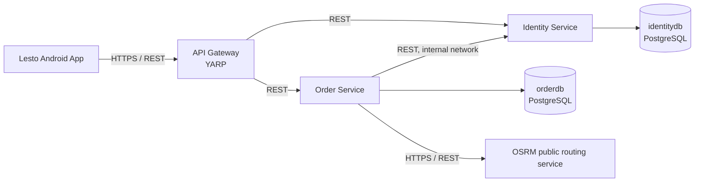

# Architecture

## 1. Architectural style

Lesto uses a microservices architecture with a single API Gateway. The two
business services are independently deployable and own their data. They use
synchronous REST communication because the reduced scope does not require
asynchronous processing.

## 2. Components

| Component | Responsibility | Publicly exposed | Data ownership |
|---|---|---:|---|
| Android App | Mobile user interface for all roles. | Yes, as a client | Local session only. |
| API Gateway | Single entry point, routing, JWT validation, and HTTPS termination. | Yes | None. |
| Identity Service | Registration, login, JWT issuance, user and role management. | No | `identitydb`. |
| Order Service | Delivery points, orders, order state machine, weight setting, and statistics. | No | `orderdb`. |
| OSRM | External route distance and duration calculation. | External provider | None. |

One PostgreSQL container hosts two logical databases during development:
`identitydb` and `orderdb`. Each service uses only its own connection string.

## 3. Communication

- The Android app calls only the API Gateway.
- Gateway-to-service and service-to-service communication uses REST over the
  private Docker network.
- Order Service calls Identity Service only to validate a selected courier at
  assignment time.
- Order Service calls OSRM only after both catalogue points have been selected.
- There is no event broker, notification service, or direct database sharing.

## 4. Security design

- Identity Service issues 60-minute HS256 JWT access tokens.
- The Gateway and both services validate token signature, issuer, audience, and
  expiry. Each service also applies role authorization locally.
- The JWT secret is supplied through environment variables or cloud settings;
  it is never committed to Git.
- Only Gateway publishes host ports. PostgreSQL, Identity Service, and Order
  Service are reachable only on the internal Compose network.
- HTTPS is terminated by Gateway in cloud deployment. Development may use HTTP
  only on localhost.

## 5. Scalability and maintenance demonstration

Docker Compose runs two Order Service containers from the same image:
`order-service-1` and `order-service-2`. YARP uses both as destinations and
round-robins requests. Each response includes `X-Served-By` so the presentation
can demonstrate distribution. Restarting one Order Service container while the
other remains available demonstrates basic maintenance resilience.

## 6. Deployment environments

| Environment | Runtime | Public access |
|---|---|---|
| Local development | Docker Compose | Gateway on `http://localhost:8080`. |
| Android emulator | Docker Compose | `http://10.0.2.2:8080`. |
| Cloud demonstration | Linux VM with Docker Compose | Gateway on HTTPS port `8443`; restricted firewall rule. |

## 7. Architecture decisions

- Two business services are sufficient to demonstrate a microservices design
  while keeping the project deliverable within the available time.
- A pre-defined point catalogue avoids sending personal delivery addresses to
  public geocoding services.
- OSRM provides a relevant external integration without route optimisation.
- Docker Compose is used instead of Kubernetes because the assignment asks for
  scalability and maintenance scenarios but does not mandate Kubernetes.
