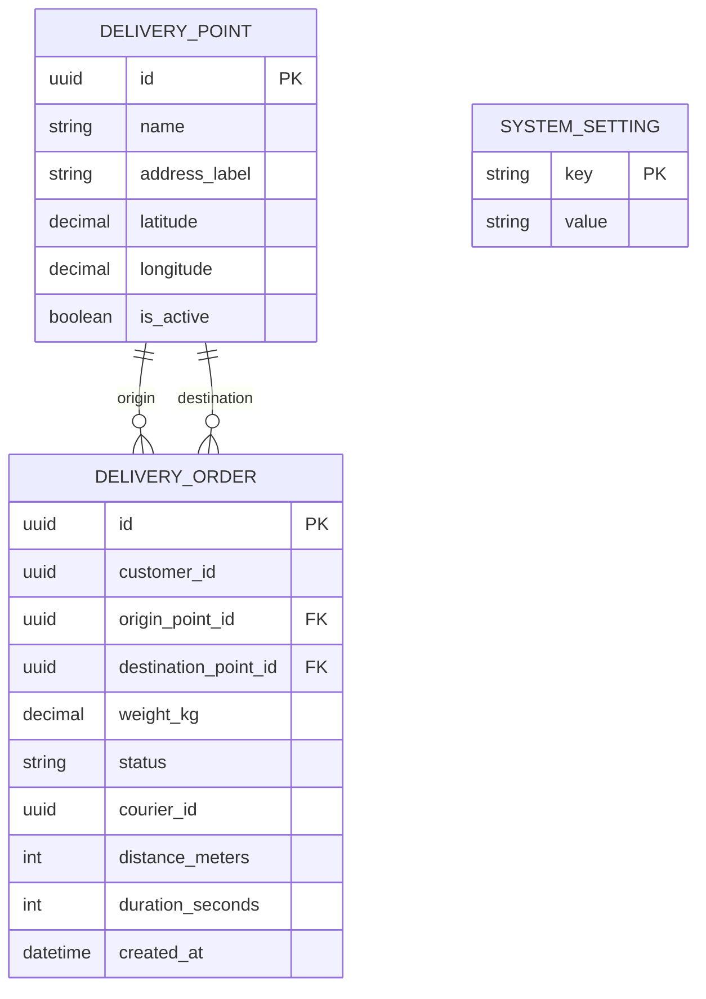

# Data Model

## 1. Boundaries

Identity Service and Order Service use separate PostgreSQL databases. There are
no foreign keys between services. Order Service stores selected user details as
a snapshot where needed, so an Identity user deletion does not invalidate past
orders.

## 2. Identity Service

Identity Service uses ASP.NET Core Identity with `Guid` keys. `AppUser` extends
the standard user with `DisplayName`.

| Field | Type | Notes |
|---|---|---|
| `Id` | `Guid` | Primary key. |
| `Email` | `string` | Unique login identifier. |
| `DisplayName` | `string` | User-facing name. |
| `Role` | `string` | `Customer`, `Courier`, `Manager`, or `Administrator`. |

Role storage follows the standard ASP.NET Core Identity tables.

## 3. Order Service

### DeliveryPoint

The catalogue contains a small, seeded list of selectable origins and
destinations. Coordinates are stored locally and are the only data sent to
OSRM.

| Field | Type | Notes |
|---|---|---|
| `Id` | `Guid` | Primary key. |
| `Name` | `string` | Display name shown in the app. |
| `AddressLabel` | `string` | Read-only descriptive label. |
| `Latitude` | `decimal` | WGS84 latitude. |
| `Longitude` | `decimal` | WGS84 longitude. |
| `IsActive` | `bool` | Controls whether the point can be selected. |

### DeliveryOrder

| Field | Type | Notes |
|---|---|---|
| `Id` | `Guid` | Primary key. |
| `CustomerId` | `Guid` | Identity user identifier; no cross-service foreign key. |
| `CustomerEmail` | `string` | Snapshot for display and audit. |
| `OriginPointId` | `Guid` | Local foreign key to `DeliveryPoint`. |
| `DestinationPointId` | `Guid` | Local foreign key to `DeliveryPoint`. |
| `WeightKg` | `decimal(8,2)` | Validated against the setting. |
| `Type` | `string` | `Document`, `Package`, `Fragile`, or `Bulky`. |
| `Description` | `string?` | Optional order description. |
| `RecipientName` | `string` | Delivery recipient. |
| `RecipientPhone` | `string` | Delivery recipient contact. |
| `DistanceMeters` | `int` | Result returned by OSRM. |
| `DurationSeconds` | `int` | Result returned by OSRM. |
| `Status` | `string` | Order state. |
| `CourierId` | `Guid?` | Assigned Identity user identifier. |
| `CourierName` | `string?` | Snapshot at assignment time. |
| `Reason` | `string?` | Rejection or delivery failure reason. |
| `CreatedAt` | `DateTimeOffset` | UTC timestamp. |
| `AssignedAt` | `DateTimeOffset?` | UTC timestamp. |
| `DeliveredAt` | `DateTimeOffset?` | UTC timestamp. |
| `UpdatedAt` | `DateTimeOffset` | UTC timestamp. |

### SystemSetting

| Field | Type | Notes |
|---|---|---|
| `Key` | `string` | Primary key; initially `MaxOrderWeightKg`. |
| `Value` | `string` | Stored configuration value. |

## 4. Entity relationship diagram

## 5. Data conventions

- All identifiers use `Guid`.
- All timestamps use `DateTimeOffset` in UTC.
- API JSON uses camelCase.
- API enum-like values use the English strings documented in this repository.
