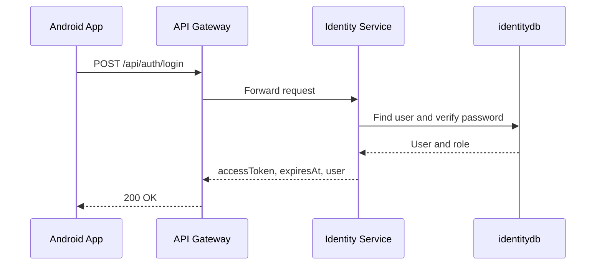
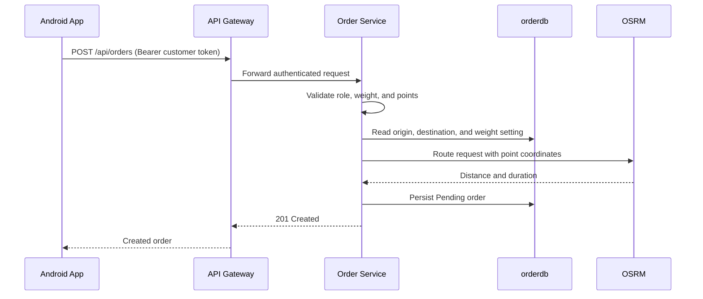
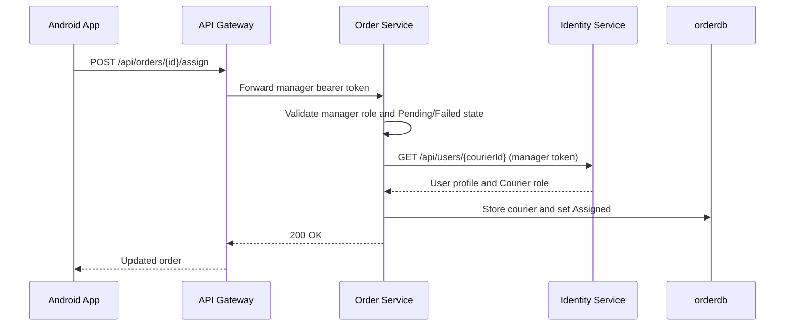
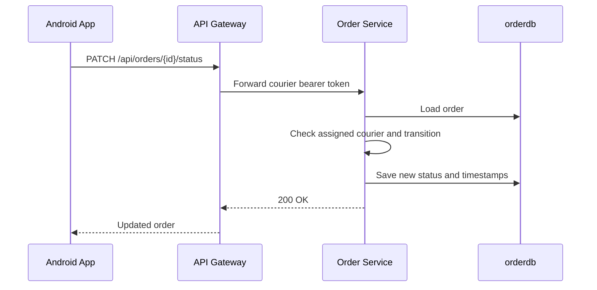

# Sequence Diagrams

## 1. Login

```mermaid
sequenceDiagram
    participant App as Android App
    participant Gateway as API Gateway
    participant Identity as Identity Service
    participant Db as identitydb

    App->>Gateway: POST /api/auth/login
    Gateway->>Identity: Forward request
    Identity->>Db: Find user and verify password
    Db-->>Identity: User and role
    Identity-->>Gateway: accessToken, expiresAt, user
    Gateway-->>App: 200 OK
```

## 2. Create order

```mermaid
sequenceDiagram
    participant App as Android App
    participant Gateway as API Gateway
    participant Order as Order Service
    participant Db as orderdb
    participant OSRM as OSRM

    App->>Gateway: POST /api/orders (Bearer customer token)
    Gateway->>Order: Forward authenticated request
    Order->>Order: Validate role, weight, and points
    Order->>Db: Read origin, destination, and weight setting
    Order->>OSRM: Route request with point coordinates
    OSRM-->>Order: Distance and duration
    Order->>Db: Persist Pending order
    Order-->>Gateway: 201 Created
    Gateway-->>App: Created order
```

## 3. Assign order

```mermaid
sequenceDiagram
    participant App as Android App
    participant Gateway as API Gateway
    participant Order as Order Service
    participant Identity as Identity Service
    participant Db as orderdb

    App->>Gateway: POST /api/orders/{id}/assign
    Gateway->>Order: Forward manager bearer token
    Order->>Order: Validate manager role and Pending/Failed state
    Order->>Identity: GET /api/users/{courierId} (manager token)
    Identity-->>Order: User profile and Courier role
    Order->>Db: Store courier and set Assigned
    Order-->>Gateway: 200 OK
    Gateway-->>App: Updated order
```

## 4. Update delivery status

```mermaid
sequenceDiagram
    participant App as Android App
    participant Gateway as API Gateway
    participant Order as Order Service
    participant Db as orderdb

    App->>Gateway: PATCH /api/orders/{id}/status
    Gateway->>Order: Forward courier bearer token
    Order->>Db: Load order
    Order->>Order: Check assigned courier and transition
    Order->>Db: Save new status and timestamps
    Order-->>Gateway: 200 OK
    Gateway-->>App: Updated order
```
